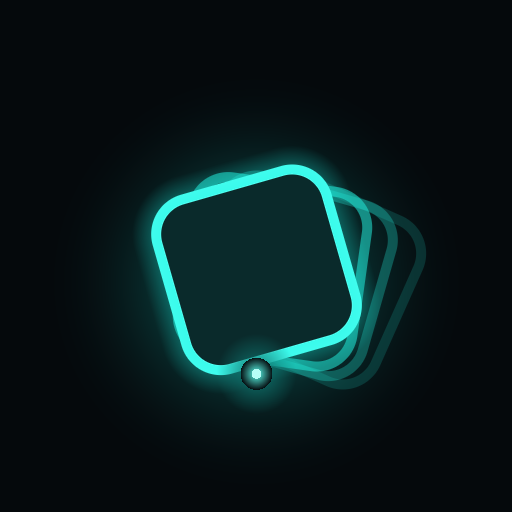

# teeter

> a custom Vulkan MilkDrop-style feedback visualizer for the ASUS ROG Ally.

teeter is a realtime, GPU-accelerated music visualizer. It captures live
system audio (WASAPI loopback) and runs it through an FFT to drive a stack of
feedback-warp fragment shaders — all rendered at fullscreen on the ROG Ally's
120 Hz display, controlled entirely by gamepad and touch.

<p align="center">
  
</p>

## Features

- **13 warp shaders** — classic MilkDrop-style feedback warps (`warp.frag` …
  `warp13.frag`), cycled live from the controller
- **Live audio-reactive DSP** — WASAPI loopback capture + FFT spectrum driving
  shader uniforms
- **Synthesized companion audio** — a live DSP synth engine (`trip-engine`)
  blended over system audio, master gain on the right trigger
- **Feedback glow pipeline** — `feedback.frag` + `composite.vert` composite,
  teeter-style tilted-panel glint
- **Fullscreen & immersive** — no window chrome, no cursor
- **Gamepad + touch input** — tuned for the ROG Ally's controller layout

## Requirements

- Windows (ROG Ally recommended) with the **Vulkan SDK** installed
  (`C:\VulkanSDK\1.4.357.0` or `VULKAN_SDK` env var)
- Rust toolchain (cargo)
- `trip-engine` crate available on disk at `../trip-engine` (live DSP synth)

## Build

```powershell
powershell -ExecutionPolicy Bypass -File build.ps1            # debug
powershell -ExecutionPolicy Bypass -File build.ps1 --release  # optimized
powershell -ExecutionPolicy Bypass -File build.ps1 --shaders-only
```

`build.ps1` compiles the GLSL shaders to SPIR-V with `glslc`, then builds the
Rust binary with cargo. Output: `target\release\teeter.exe`.

## Controls (ROG Ally / Xbox layout)

| Input | Action |
| --- | --- |
| Left stick | warp tilt (X / Y) |
| Right stick | rotate / zoom |
| LB / RB / D-pad L/R / triggers | palette shift (manual color cycle) |
| A (South) | next preset |
| B (East) | next warp shader |
| R trigger (analog) | master gain |
| D-pad up / down | more / less live system-audio blend |
| Touch swipe / pinch | warp tilt / zoom |
| Touch tap | next preset |

## Project layout

```
teeter/
├── src/
│   ├── app.rs          # app state + frame loop
│   ├── audio/          # WASAPI loopback capture + FFT + EQ
│   ├── engine/         # feedback engine run-time state
│   ├── input/          # gamepad + touch → navigation state
│   └── vulkan/         # Vulkan pipeline, renderer, shader stage setup
├── shaders/            # GLSL warps + feedback/composite stages
├── scripts/            # logo / icon generators
├── assets/             # logo + icon
└── build.ps1           # shader compile + cargo build
```

## License

MIT